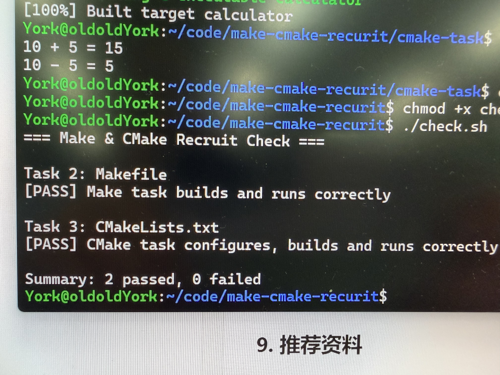

# Task 4：思考题

## 1. Make 和简单的 build.sh 有什么区别？

make只会重新构建过期的部分。它只会重新构建改过的/时间刷新过的代码。
build.sh是都重新构建，不管有没有改动
优势:make可以在改动文件后只编译相关改动部分，与build一个个编译相比，它有利于大量文件的并行编译，更省力

## 2. CMake 是编译器吗？
CMake 不是编译器

执行 `cmake --build build` 时，最终是谁在编译 C 源文件？
是编译器本身gcc

## 3. 为什么不希望每次都重新编译所有 `.c` 文件？
代码多了，项目大了后，每次都重新编译，第一很慢，时间不等人，第二浪费能源，一些编译是白干的

